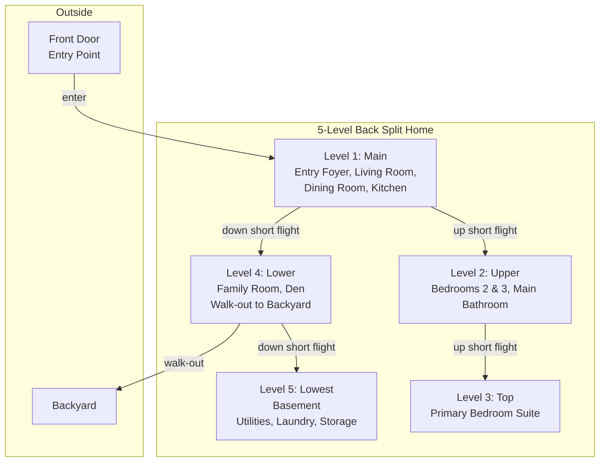

# 5-Level Back Split Visualization

Here is a flowchart of the house layout:

```mermaid
flowchart TD
    subgraph Outside
        A[Front Door<br>Entry Point]
        B[Backyard]
    end

    subgraph House[5-Level Back Split Home]
        L5[Level 5: Lowest<br>Basement<br>Utilities, Laundry, Storage]
        L4[Level 4: Lower<br>Family Room, Den<br>Walk-out to Backyard]
        L1[Level 1: Main<br>Entry Foyer, Living Room,<br>Dining Room, Kitchen]
        L2[Level 2: Upper<br>Bedrooms 2 & 3, Main Bathroom]
        L3[Level 3: Top<br>Primary Bedroom Suite]
    end

    A -->|enter| L1
    L1 -->|down short flight| L4
    L4 -->|down short flight| L5
    L1 -->|up short flight| L2
    L2 -->|up short flight| L3
    L4 -->|walk-out| B
```
